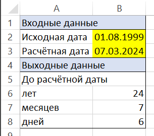
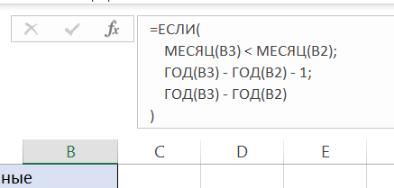
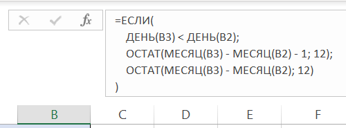
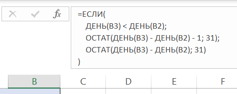

# Инструмент Расчёт лет, месяцев и дней в интервале дат

## Описание
Калькулятор, которого мне давно не хватало для работы.
Всё просто: в жёлтых полях вводим исходную дату и расчётную.
Программа по формулам сделает расчёты и обновит требуемые поля.
MS Excel представляет прекрасный функционал для расчётов, организации, хранения, поиска и накопления данных.
Может есть вариант написать формулы проще, но меня этот вариант вполне устраивает.

## Скриншоты

